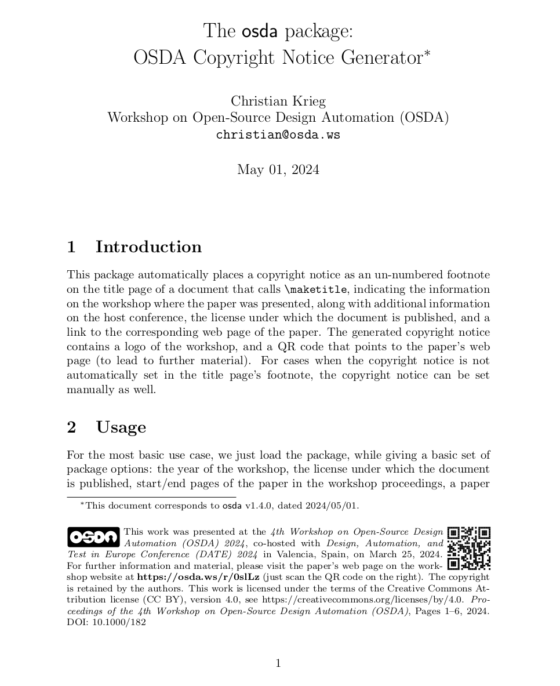

# latex-osda

This LaTeX package contains commands useful for papers that are published in the
Proceedings of the Workshop on Open-Source Design Automation (OSDA).

This package automatically places a copyright notice as an un-numbered
footnote on the title page of a document that calls ``\maketitle``, indicating
the information on the workshop where the paper was presented, along with
additional information on the host conference, the license under which the
document is published, and a link to the corresponding web page of the paper.
The generated copyright notice contains a logo of the workshop, and a QR code
that points to the paper's web page (to lead to further material). For cases
when the copyright notice is not automatically set in the title page's
footnote, the copyright notice can be set manually as well.



## Usage

For the most basic use case, we just load the package, while giving a basic
set of package options: the year of the workshop, the license under which the
document is published, start/end pages of the paper in the workshop
proceedings, a paper URL under which further information on the paper is
available, and a Digital Object Identifier (DOI) that uniquely identifies the
publication. The following listing shows the command to load the package
with options that generates the copyright notice visible in the example image
above.

```
\usepackage[
    2024,
    cc-by,
    pages={1}{6},
    url=https://osda.ws/r/aaVHo,
    doi=10.1000/182,
]{osda}
```

Please consult the package documentation for more detailed instructions on how
to use the package.


## Geneate the LaTeX package

To generate the LaTeX package ``osda.sty``, simply run the following command:

```
latex osda.ins
```

## Generate the documentation

To generate a PDF ``osda.pdf`` with the package documentation, please run the following
command:

```
pdflatex osda.dtx
```

## License information

Copyright 2023-2024 by Christian Krieg (christian@osda.ws)

This work (excluding the OSDA logo) may be distributed and/or modified under the
conditions of the LaTeX Project Public License, either version 1.3 of this
license or (at your option) any later version.  The latest version of this
license is in http://www.latex-project.org/lppl.txt and version 1.3 or later is
part of all distributions of LaTeX version 2005/12/01 or later.

This work has the LPPL maintenance status `maintained'.

The Current Maintainer of this work is Christian Krieg.

This work consists of the files osda.dtx and osda.ins and the derived file
osda.sty.

The OSDA logo is a trademark of Christian Krieg and may only be used and/or
distributed in order to refer to the Workshop on Open-Source Design Automation.
Any other use is subject to prior written permission.
